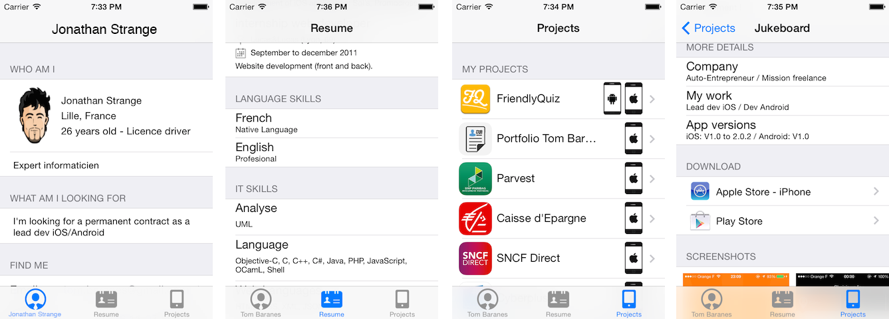

Portfolio_iOS Template
===

This project is a useful template to create a portfolio iOS app in **only two steps**:

1. Customise three plist with your own data (identity, resume, projects, etc.)
2. Create an app icon and launch images (if you want to publish it)
3. Well done, you have a full functional portfolio iOS app

Screenshots
------

Requirements
------

This template requires Xcode 5, targeting iOS 7.0 and above.

How to use it
------

Clone/fork the project, and read the [wiki](https://github.com/tbaranes/Portfolio_iOS/wiki) to get all the information necessary to create your own portfolio.

Feedback
------

  * If you found a **bug**, open an **issue**
  * If you have a **feature request**, open an **issue**
  * If you want to **contribute**, submit a **pull request**
  * If you have any problem or question about this template, contact me

Contact
------

* [@tbaranes](https://github.com/tbaranes/) on github

Licence
------

Portfolio_iOS is under the Apache license. See the MIT Licence file for more information.
